# Проект «Spam‑Checker ML‑Service»

> **Кратко:** веб‑сервис выявления спам‑SMS, свёрнутый в `docker‑compose` из трёх контейнеров — **frontend** (JS + NGINX), **backend** (FastAPI + ONNX), **monitoring** (Prometheus + Pushgateway + Grafana). Сервис принимает одиночные и батч‑запросы, переобучает модель на ходу, логирует все метрики и визуализирует их в Grafana.

---

## Содержание

1. [Схема архитектуры](#схема-архитектуры)
2. [Быстрый старт](#быстрый-старт)
3. [Структура репозитория](#структура-репозитория)
4. [API — описание эндпоинтов](#api-endpoints)
5. [Использование фронтенда](#использование-фронтенда)
6. [Переобучение и эксперименты](#переобучение-и-эксперименты)
7. [Мониторинг и дашборды](#мониторинг-и-дашборды)
8. [Расширение проекта](#расширение-проекта)
9. [Лицензия](#лицензия)

---

## Схема архитектуры

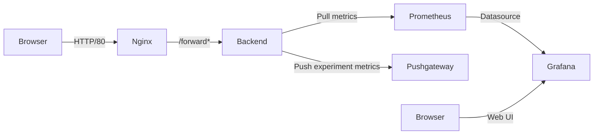
* **ML** датасет https://www.kaggle.com/uciml/sms-spam-collection-dataset
* **Frontend** отдаёт статику и проксирует API‑запросы на `backend:8000`.
* **Backend** выполняет инференс через ONNX Runtime, метрики отдаёт на `/metrics`.
* **Prometheus** опрашивает `/metrics`, **Pushgateway** отправляет метрики экспериментов; **Grafana** объединяет всё в один дашборд.

---

## Быстрый старт

```bash
# 1. Клонировать репозиторий и перейти в каталог
$ git clone https://github.com/khoribz/ml-service.git
$ cd ml-service

# 2. Создать .env
$ cp .env.example .env      # при желании отредактируйте

# 3. Собрать и запустить
$ docker compose up -d --build

# 4. Проверить сервисы
#    UI:          http://localhost             (порт 80)
#    Swagger:     http://localhost:8000/docs   (backend)
#    Grafana:     http://localhost:3000 (admin/admin)
```

Остановка:

```bash
docker compose down -v
```

---


## Структура репозитория

```text
.
├─ backend/           # FastAPI + модели
│  └─ src/
│  └─ data/           # DVC‑tracked датасеты
│  └─ models/         # ONNX‑модели (prod и эксперименты)
│  └─ Makefile        # локальные удобные команды
├─ frontend/          # JS + Nginx конфиг
├─ monitoring/        # Prometheus.yml, Grafana provisioning
└─ docker-compose.yml
```

---

## API — Endpoints

| Метод  | Путь                       | Описание                                                                                                    |
| ------ | -------------------------- | ----------------------------------------------------------------------------------------------------------- |
| `POST` | `/forward`                 | Инференс одного сообщения.<br>**Body**: `{"text": "Message"}` → **200** `{"label": 1, "probability": 0.97}` |
| `POST` | `/forward_batch`           | CSV-файл с колонкой `text`; ответ — JSON‑массив.                                                            |
| `POST` | `/evaluate`                | CSV c колонками `text,label`; возвращает predictions + метрики (accuracy, F1).                              |
| `PUT`  | `/add_data`                | Загружает размеченный CSV в тренировочный датасет.                                                          |
| `PUT`  | `/retrain`                 | Асинхронно переобучает модель; пушит метрики в Prometheus / Pushgateway.                                    |
| `GET`  | `/metrics/{experiment_id}` | JSON с метриками нужного эксперимента.                                                                      |
| `POST` | `/deploy/{experiment_id}`  | Делает выбранную модель прод‑версией.                                                                       |

Пример `curl`:

```bash
curl -X POST http://localhost/forward \
     -H 'Content-Type: application/json' \
     -d '{"text":"You won 1000000$!"}'
```

---

## Использование фронтенда

| Действие                                        | Скриншот                                                       |
|-------------------------------------------------|----------------------------------------------------------------|
| Одиночный запрос - не спам                      | 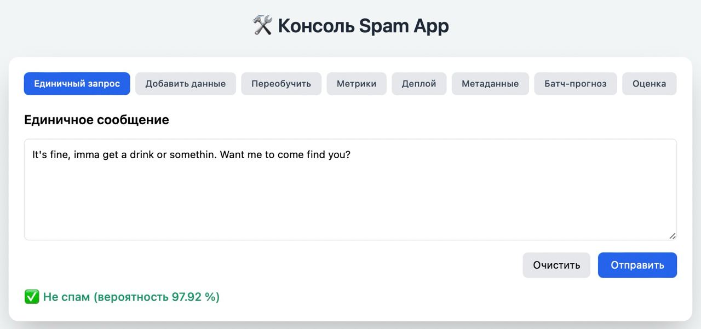       |
| Одиночный запрос - спам                         | 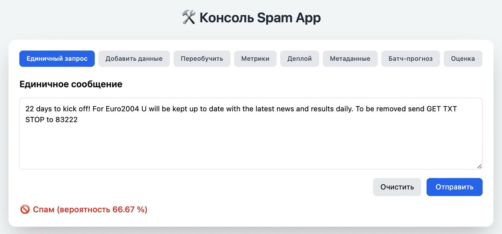             |
| Батч‑оценка CSV                                 | 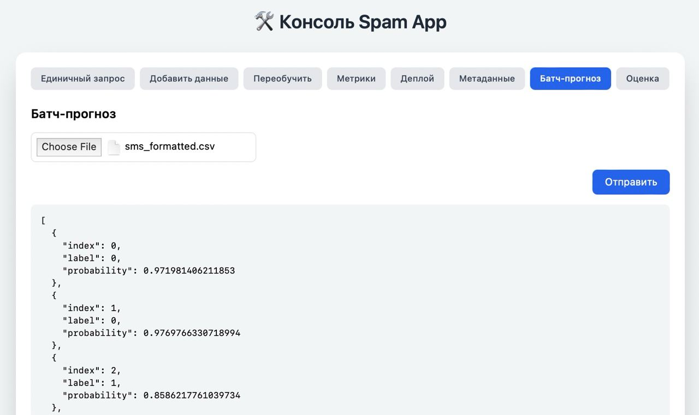                           |
| Добавить к текущему датасету новые данные в CSV | 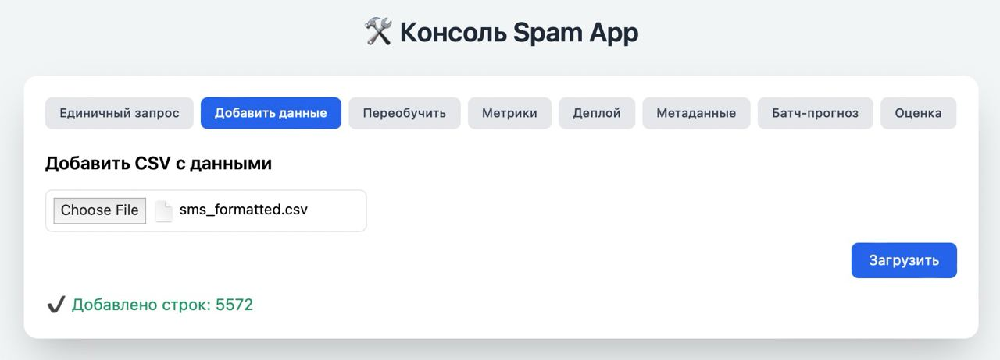                     |
| Переобучить модель                              | 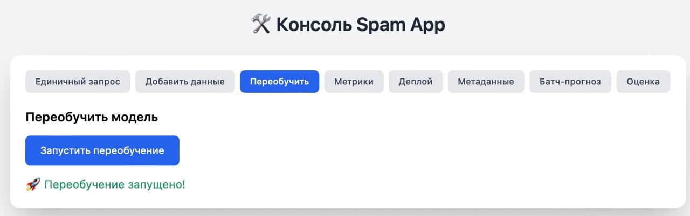                       |
| Получить метрики по эксперименту                | 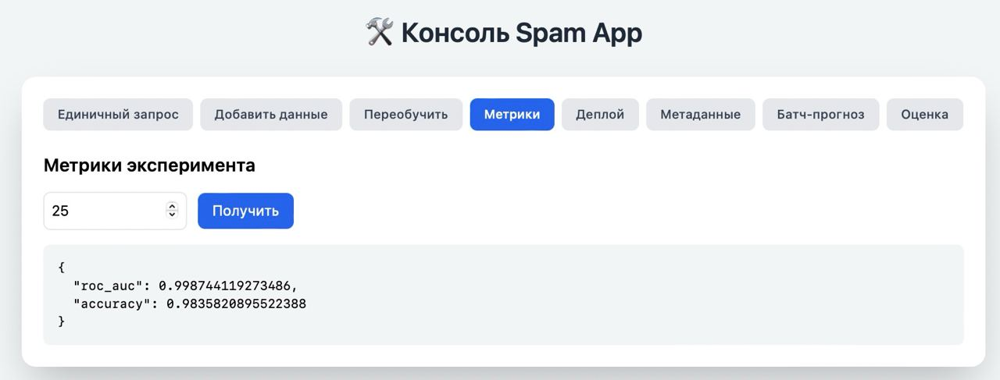 |
| Задеплоить эксперимент                          | 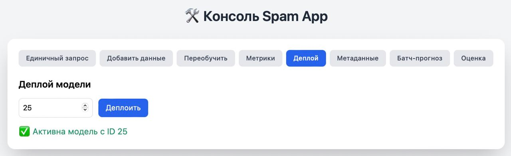                         |
| Вернуть метрики для загруженного датасета       | 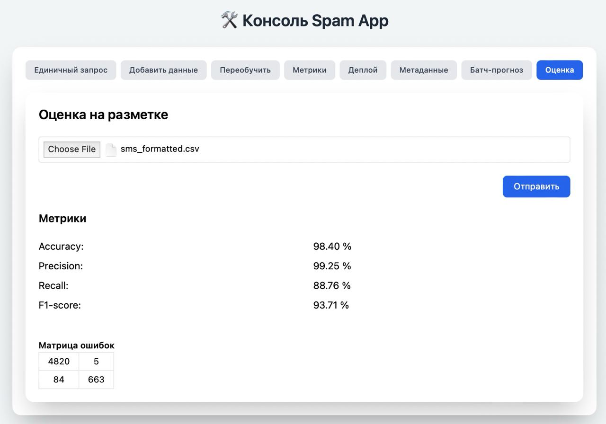                     |

---

## Переобучение и эксперименты

```bash
# 1. Добавляем новые размеченные данные
curl -X PUT -F file=@data/new_samples.csv http://localhost/add_data

# 2. Стартуем retrain (работает в BackgroundTasks)
curl -X PUT http://localhost/retrain

# 3. Проверяем метрики 12‑го эксперимента
curl http://localhost/metrics/12 | jq

# 4. Деплоим лучшую модель
curl -X POST http://localhost/deploy/12
```

Каждый retrain‑run пушит в Pushgateway метрики: `experiment_roc_auc{experiment_id="12"}`, `experiment_accuracy{experiment_id="12"}`.

---

## Мониторинг и дашборды

* **Prometheus** доступен на [http://localhost:9090](http://localhost:9090) — вкладка *Targets* покажет `backend` и `pushgateway` со статусом **UP**.
* **Grafana**: [http://localhost:3000](http://localhost:3000) (логин `admin/admin`).<br>Дашборд «FastAPI Observability» импортируется при желании, метрики будут подтягиваться сами:

  * кол‑во запросов/сек;
  * ошибки 4xx/5xx;
  * p99 latency;
  * кривые `experiment_roc_auc`, `experiment_accuracy` для всех экспериментов.

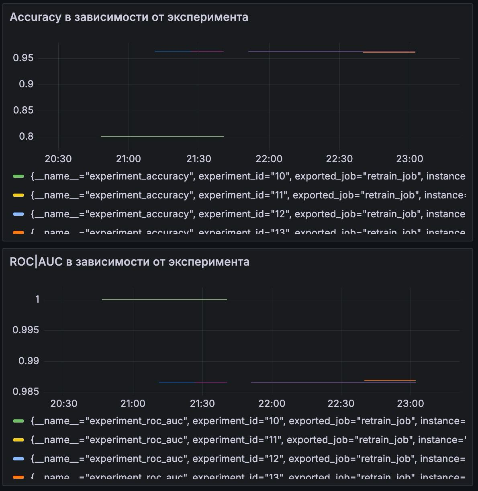

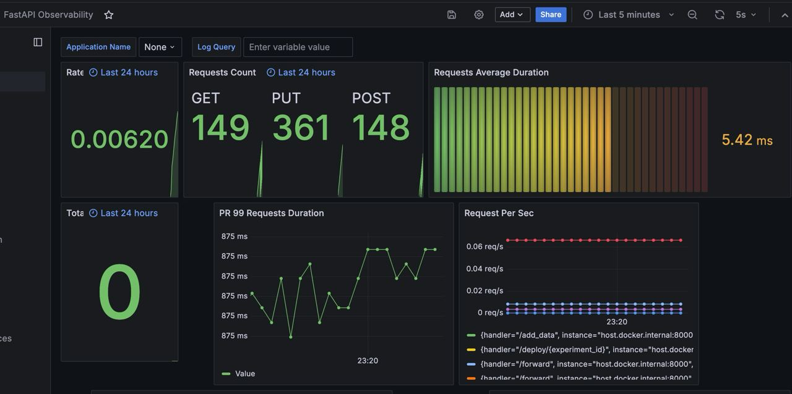

---


## Лицензия

Проект распространяется под лицензией **MIT**. См. файл `LICENSE` в корне репозитория.
